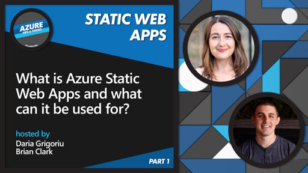
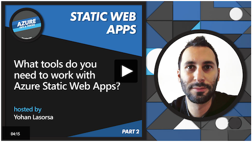
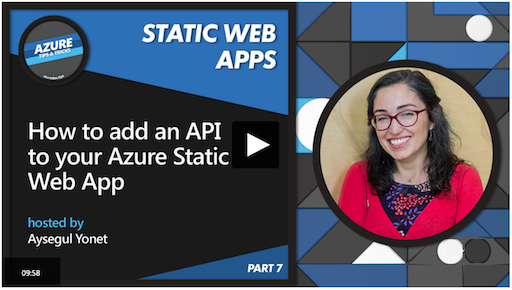
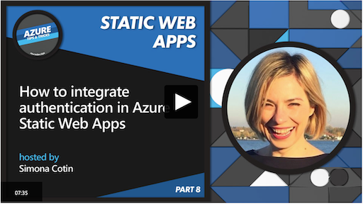
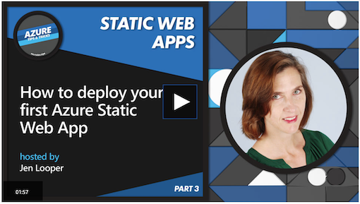

## Build and Deploy your Prototype to the Cloud

In this lesson, you will learn how to take a prototype and deploy it to the cloud. Assuming you have built your application for either a web or mobile platform, you need to find a way to showcase it live for users to try as a true prototype. In this lesson, you can view a series of videos on how to build a Power App for mobile, and how to build and deploy a web app using Azure Static Web Apps.

[Introductory quiz](https://zealous-pebble-06ae2440f.azurestaticapps.net)

**What we will cover:** 

- Mobile Apps : Try a Power App

> 📹 Click the image to learn how to get started with Power Apps with a series of videos

- Web Apps - Try Static Web Apps

> 📹 Click the image to learn how to get started with Azure Static Web Apps with a series of videos
## Building with Power Apps

Low-code solutions such as Power Apps are a great way to quickly move from prototype to production app in short order. This overview walks you through [Power Apps](https://dynamics.microsoft.com/guidedtour/power-platform/power-apps/1/1) and the many interesting things you can do with them.

- Learn more about Power Apps in [this introduction](https://docs.microsoft.com/learn/modules/introduction-power-apps/)

- Discover more about building your [UI in a Power App](https://docs.microsoft.com/learn/paths/ui-controls-canvas-app-powerapps/)

- If you want to create a Power App to show charts and graphs, try [this Learn path](https://docs.microsoft.com/learn/paths/create-app-models-business-processes/) on the topic.

Power Apps have a [great community](https://wearepoweraddicts.com/) who can help you as well!
## Flexing your Web Muscles

As you move from wireframes to building out a web app, there are certain skills you need to learn to build a performant, secure, responsive, attractive web application. First, you need to learn the building blocks of the web. A good technical stack to become skilled in includes HTML, CSS and JavaScript. 
### Learn the basics

Learn the basics of JavaScript with [this web development Learn Path](https://docs.microsoft.com/learn/paths/web-development-101/)

Try your hand at building a web application with HTML, CSS and JavaScript with [this module](https://docs.microsoft.com/learn/modules/build-simple-website/)

Then, once you have mastered this technical stack, learn a JavaScript framework to make your prototyping work easier. 
### Try a framework

- [Vue.js](https://docs.microsoft.com/learn/paths/vue-first-steps/)
    "Vue.js is a progressive web framework allowing developers to get up and running quickly, with the addition of a script tag. However, Vue.js can also grow with you, and can be used to create large scalable applications."

- [React.js](https://docs.microsoft.com/learn/paths/react/) 
    "Developers use JSX, a combination of HTML and JavaScript, to create views in a natural way. Developers can also create components for blocks that can be reused across their applications. This module introduces React and the core skills developers need to use this powerful framework."

> 💡 Tip: An alternate way to develop web applications, for folks who prefer to use Python over JavaScript, is by using [Django](https://docs.microsoft.com/learn/modules/django-get-started/). "Django is one of the most popular Python web frameworks. It's especially powerful when working with a data-driven application, where the main goal is to provide a front end to a database. Django comes with numerous features built in to streamline the development process. In this module, we explore the benefits of Django, how to install it, and how to create your first project."
## Using Static Web Apps

Static Web Apps are a terrific way to host your prototype in a cost-effective way in the cloud. Not only can you quickly deploy your prototype using GitHub Actions, you can also build an API from within this ecosystem and create a quick login experience, perfect for your prototype.

You can develop from within Visual Studio Code together with GitHub actions as your toolchain:

> 📹 Click the image to learn about the tools and setup you need to get started with Static Web App development

> 💡 Tip: Learn all about Static Web Apps in this [Learn path](https://docs.microsoft.com/en-us/learn/paths/azure-static-web-apps/) and [this video series](https://channel9.msdn.com/Series/Azure-Tips-and-Tricks-Static-Web-Apps)
### Integrate an API and Authentication

Web apps rarely rely on just front-end code to deliver an immersive experience. Your prototype might need authentication so that users can login. You might also need to create an API of your own to call a database or other data source. You can do this from within the Static Web App ecosystem.
#### Call an external API

In most of your applications, you will need to make external calls to databases and external web sites to access and use external data. For that, you might use an API (Application Programming Interface). Learn about APIs and their uses in this [Learn module](https://docs.microsoft.com/learn/modules/use-apis-discover-museum-art/).
#### DIY an API

Another way to use a datasource in your app is to build an API of your own. This is supported well by Static Web Apps, and you can learn how to build your own API with this [Learn module](https://docs.microsoft.com/learn/modules/publish-static-web-app-api-preview-url/).

 > 📹 Click the image to learn how to build an API within your Static Web App
#### Authentication

You might need to protect parts of your app behind an authentication screen. This is a process that is rendered more easy to build by using Static Web Apps. Learn how with this [Learn module](https://docs.microsoft.com/learn/modules/publish-static-web-app-authentication/).

> 📹 Click the image to learn how authenticate users of your application
## Deploy your app

Once you are ready to deploy your app, you can do it right from within Visual Studio Code. 

> 📹 Click the image to learn how to deploy your app to the cloud

---
## Summary

In this lesson, you learned about several ways to build a web and mobile app to bring your prototype to the cloud and to your user. While there are many ways to create these kind of apps, these tools will help you speed up your process from prototype to production.

**Move on the to the next lesson here!** *Needs Updating
